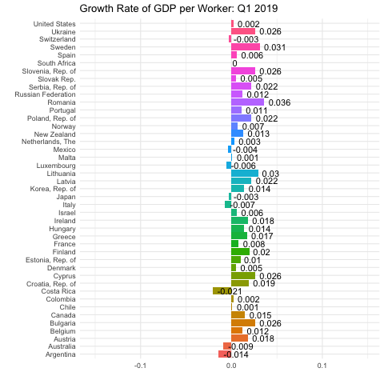

Question 1:
```{r, collapse=T}
library(tidyverse)
library(dplyr)
library(gganimate)
library(gifski)
imf_growth <- read_csv(url('https://bcdanl.github.io/data/imf_growth_quarterly.csv'))

imf_growth <- imf_growth %>% 
  mutate(gy = round(gy, digits = 3))

p <- ggplot(imf_growth, aes(x= country, y= gy, fill= country))+
geom_col()+ geom_text(aes(label=as.character(gy), hjust = -0.2))+ coord_flip()
fig_GDP <- p + transition_states(quarter, transition_length = 1, state_length =1) +
  labs(title = "Growth Rate of GDP per Worker: {closest_state}", x = "", y= "")+
  theme_minimal()+ theme(legend.position = "none")

# animate(fig_GDP, renderer = gifski_renderer("chewy_hw4_q1.gif"))

```

Question 2:
```{r}
library(tidyverse)
library(dplyr)
library(ggiraph)
library(socviz)
library(ggthemes)
library(plotly)
climate_opinion_long <- read_csv(
  'https://bcdanl.github.io/data/climate_opinion_2021.csv')

county_map <- county_map
county_map$id <- as.integer(county_map$id)
county_full <- left_join(county_map, climate_opinion_long)


na_map <- function(yr){
  county_full_na <- filter(county_full, is.na(belief)) %>% 
    select(-belief) %>% 
    mutate( belief = yr)
}

for (val in  levels( factor(county_full$belief) )  ){
  county_full <- rbind(county_full, na_map(val))
}

county_full <- county_full %>% 
  mutate(belief_desc = ifelse(belief == "happening",
                              "Global warming is happening.",
                              "Global warming is mostly caused by human activities."))

county_full_1<- county_full %>% 
  filter(belief == "human")


library(ggiraph)
x1 <- ggplot(data = county_full_1) + 
  geom_polygon_interactive(mapping = aes(x = long, y = lat, 
                             group = group, fill = perc, tooltip = GeoName, data_id = perc ),
               color = "grey60", size = 0.1) 


x2 <- x1 + scale_fill_gradient2( 
  low = '#2E74C0',  
  high = '#CB454A',  
  mid = 'white', # transparent white
  na.value = "grey80",
  midpoint = 50,
  breaks = c(quantile(county_full$perc, 0, na.rm = T),
             quantile(county_full$perc, .25, na.rm = T),
             quantile(county_full$perc, .5, na.rm = T),
             quantile(county_full$perc, .75, na.rm = T),
             quantile(county_full$perc, 1, na.rm = T)),
  labels = c(paste(round(quantile(county_full$perc, 0, na.rm = T), 1),"(Min)"),
             paste(round(quantile(county_full$perc, .25, na.rm = T), 1),"(25th)"),
             paste(round(quantile(county_full$perc, .5, na.rm = T), 1),"(50th)"),
             paste(round(quantile(county_full$perc, .75, na.rm = T), 1),"(75th)"),
             paste(round(quantile(county_full$perc, 1, na.rm = T), 1),"(Max)")
  ),
  guide = guide_colorbar( direction = "horizontal",
                          barwidth = 25,
                          title.vjust = 1 )
) 

x <- x2 + labs(fill = "Percent Belief", title = "U.S. Climate Opinion, 2021: Global warming is mostly caused by human activities.",
               caption = "Sources: Yale Program on Climate Change Communication\n(https://climatecommunication.yale.edu/visualizations-data/ycom-us/)") +
  theme_map() + 
  theme(plot.margin = unit( c(1, 1, 3.85, 0.5), "cm"),
        legend.position = c(.5, -.3),
        legend.justification = c(.5,.5),
        strip.background = element_rect( colour = "black",
                                         fill = "white",
                                         color = "grey80" ))+
  guides(fill = guide_colourbar(direction = "horizontal", barwidth = 25, title.vjust = -1))

widg <- ggiraph(ggobj = x, width_svg = 8, height_svg = 8)

htmlwidgets::saveWidget(widg, file= "ggiraph.html")

fig_climate <- ggplotly(x) %>% 
  layout(title = list(text = paste0("U.S. Climate Opinion, 2021",
                                    '<br>',
                                    '<sup>',
                                    'Global warming is mostly caused by human activities',
                                    '</sup>')),
         annotations = 
           list(x = 1, y = -0.15, 
                text = "Sources: Yale Program on Climate Change Communication\n(https://climatecommunication.yale.edu/visualizations-data/ycom-us/)", 
                showarrow = F, xref='paper', yref='paper', 
                xanchor='right', yanchor='auto', xshift=0, yshift=0))

fig_climate
```

